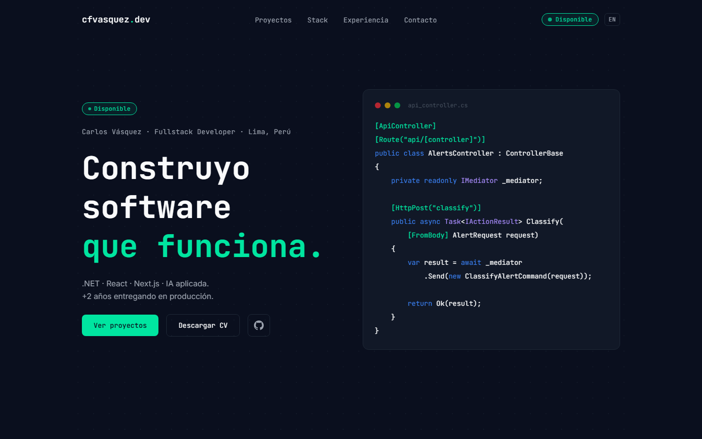
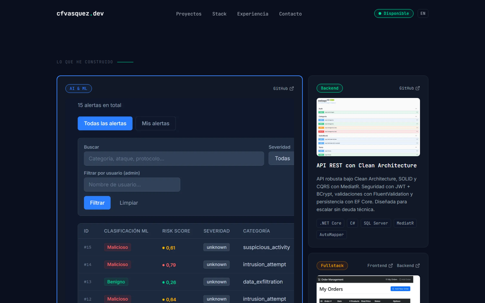

# Carlos Vásquez — Portfolio

> Portafolio personal construido con Next.js 16 (App Router) — proyectos, stack y contacto con envío real de email, sin `mailto:` de respaldo.





[](https://portfolio-nextjs-sigma-olive.vercel.app/)

---

## 🧩 Problema / Contexto

Portafolio personal para mostrar experiencia como Desarrollador Fullstack (.NET, React/Next.js) con foco en DevOps e IA aplicada. Reemplaza al CV estático con case studies reales, métricas de producción (SOC, migraciones, eficiencia operativa) y un canal de contacto que efectivamente envía el mensaje.

---

## 🛠️ Stack

| Capa            | Tecnología                              |
|-----------------|------------------------------------------|
| Frontend        | Next.js 16 (App Router), React 19, TypeScript |
| Estilos         | Tailwind CSS v4, Framer Motion            |
| Iconografía     | simple-icons, lucide-react                |
| Contacto        | Resend (Route Handler, envío real de email) |
| Analytics       | Vercel Analytics                          |
| Deploy / Infra  | Vercel                                    |
| Package manager | pnpm                                      |

---

## 🏗️ Arquitectura

- App Router — una sección por componente en `components/`, ensambladas en `app/page.tsx`.
- El formulario de contacto no usa `mailto:` — postea a `app/api/contact/route.ts`, que valida los datos en el servidor y envía el correo real vía Resend.
- El contenido (proyectos, experiencia, stack) vive como arrays tipados dentro de cada componente — sin CMS ni fetch externo; portafolio personal, se actualiza vía PR.

---

## 🧠 Retos técnicos y decisiones

- **Problema:** varios íconos del stack (C#, Java) no existen en `simple-icons`. → **Solución:** fallback a una etiqueta con las 2 primeras letras cuando `icon` es `null`. → **Por qué:** evita romper el build o mostrar un ícono genérico incorrecto.
- **Problema:** Next.js 16 deprecó la prop `priority` de `next/image` en favor de `loading`/`preload`. → **Solución:** las cards de proyectos usan `loading="eager"` solo en la featured y en la que ocupa el ancho completo (las candidatas reales a LCP). → **Por qué:** esta versión de Next trae breaking changes respecto a la documentación estándar de Next.js — hay que revisar `node_modules/next/dist/docs` antes de asumir comportamiento.
- **Problema:** el formulario de contacto necesitaba enviar el mensaje de verdad, no depender de que el visitante tenga un cliente de correo configurado. → **Solución:** Route Handler propio + Resend, con validación de email y longitud de mensaje en el servidor. → **Por qué:** un `mailto:` como único canal tiene mala tasa de conversión.

---

## 🚀 Cómo correrlo

```bash
git clone https://github.com/Carlou134/portfolio-nextjs.git
cd portfolio-nextjs
pnpm install
pnpm dev
```

Variable de entorno necesaria (`.env.local`):

```
RESEND_API_KEY=tu_api_key_de_resend
```

Abrir [http://localhost:3000](http://localhost:3000).

---

## ✅ Calidad de código

```bash
pnpm lint   # ESLint (next lint fue removido en Next.js 16)
pnpm test   # Vitest + React Testing Library
```

Los tests cubren donde hay lógica real, no marcado estático: validación y envío del formulario de contacto (`app/api/contact/route.test.ts`), y el menú mobile del navbar (`components/Navbar.test.tsx`, `components/Contact.test.tsx`).
